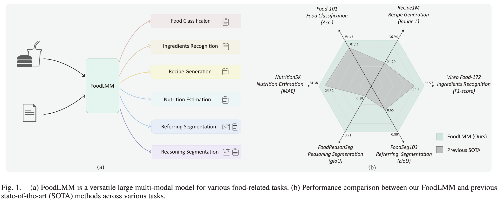
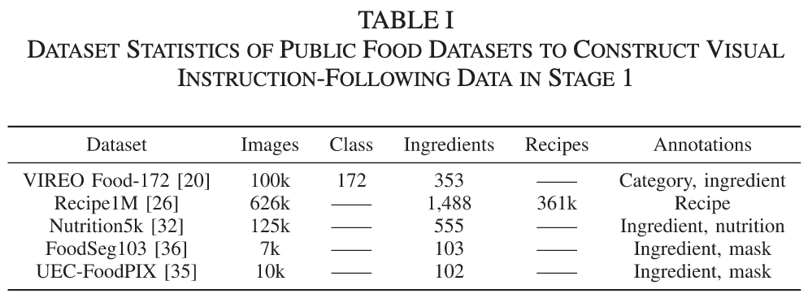
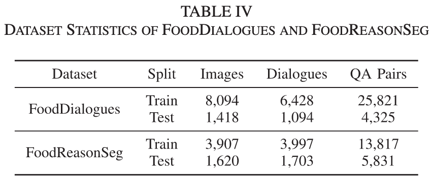
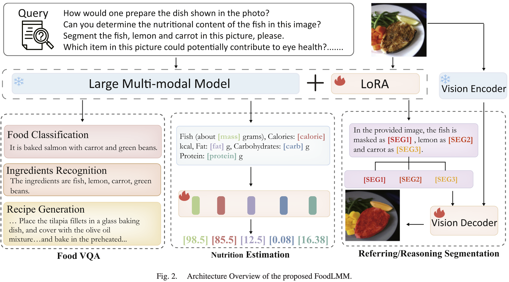

# FoodLMM: A Versatile Food Assistant Using Large Multi-Modal Model

**Author**: Yuehao Yin , Huiyan Qi , Bin Zhu , Jingjing Chen, Yu-Gang Jiang, Chong-Wah Ngo

**Publish Date**: 2025

**Add Date**: 2025.11.23

**Journal/Meeting**: IEEE Transactions on Multimedia

**Star**: 🌟🌟🌟🌟🌟

**PDF**: [FoodLMM: A Versatile Food Assistant Using Large Multi-Modal Model](original_files/Yin_2025_FoodLMM_A_Versatile_Food_Assistant_Using_Large_Multi-Modal_Model.pdf)

## 1 Introduction

## 2 Related Work

### 2.1 Large Language Model

### 2.2 Food Analysis

### 2.3 Referring Segmentation

## 3 Food Visual Instruction-Following Data

### 3.1 Stage 1: Public Food Datasets

- *Food VQA*

- *Nutrition Estimation*

- *Food Segmentation*

### 3.2 Stage 2: GPT-4 Generated Conversation Datasets

- ***FoodDialogues***: multi-round conversation dataset

- ***FoodReasonSeg***: food reasoning segmentation dataset

## 4 Method

### 4.1 Stage 1: Multi-Task Learning

***Food VQA***

$$\mathcal{L}_{txt} = \mathbf{CE}(\hat{\boldsymbol{y}}_{txt}, \boldsymbol{y}_{txt}). \tag{1}$$

***Nutrition Estimation***

$$\mathcal{L}_{\text{nutrition}} = \lambda_{\text{MAE}}\left(\frac{1}{n}\sum_{i=1}^{n}\left|y_{i}-\hat{y}_{i}\right|\right) + \lambda_{\text{MSE}}\left(\frac{1}{n}\sum_{i=1}^{n}\left(y_{i}-\hat{y}_{i}\right)^{2}\right). \tag{2}$$

***Referring Segmentation***

$$
\begin{aligned}
\mathcal{L}_{\text{mask}} = & \lambda_{bce} \frac{1}{n} \sum_{i=1}^{n} \operatorname{BCE}\left(\hat{M}_{i}, M_{i}\right) \\
& +\lambda_{\text{dice}} \frac{1}{n} \sum_{i=1}^{n} \operatorname{DICE}\left(\hat{M}_{i}, M_{i}\right).
\end{aligned}
\tag{3}
$$

Types of referring instructions:

1) to segment certain specified ingredients (one-to-one/one-to-many)

2) to segment all visible ingredients (one-to-many)

3) to segment objects that are not present in the image (one-to-zero)

Thus, the overall loss is:

$$\mathcal{L} = \lambda_{txt}\mathcal{L}_{txt} + \lambda_{\text{nutrition}}\mathcal{L}_{\text{nutrition}} + \lambda_{\text{mask}}\mathcal{L}_{\text{mask}}. \tag{4}$$

### 4.2 Stage 2: Fine-Tuning for a Versatile Food Assistant

***Multi-round Conversation***

$\mathcal{L}_{txt}$ (1)

***Reasoning Segmentation***

$\mathcal{L}_{mask}$ (3)

## 5 Experiment

### 5.1 Experimental Setup

### 5.2 Evaluation Metrices

### 5.3 FoodVQA Results

### 5.4 Nutrition Estimation Results

### 5.5 Referring Segmentation Results

### 5.6 Performance on the Porposed Benchmarks

### 5.7 Discussion About Multi-Task and Single-Task Learning

## 6 Conclusion