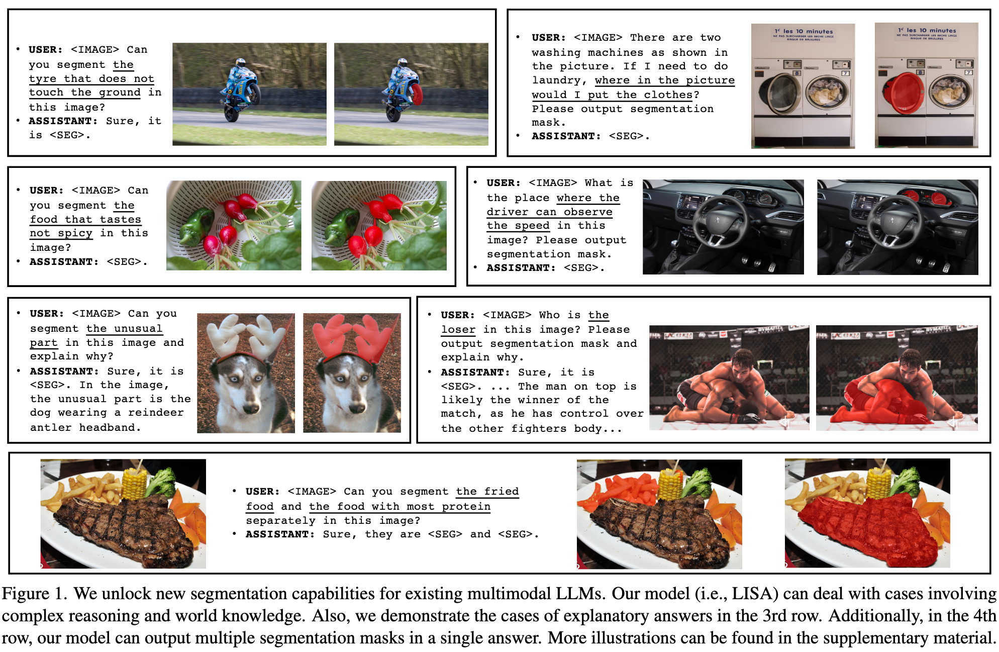
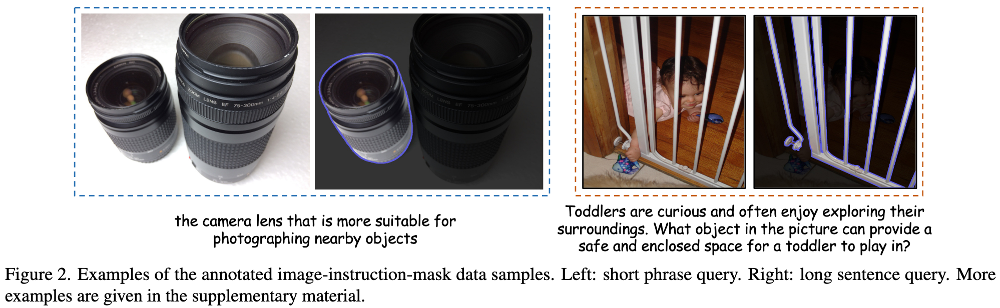
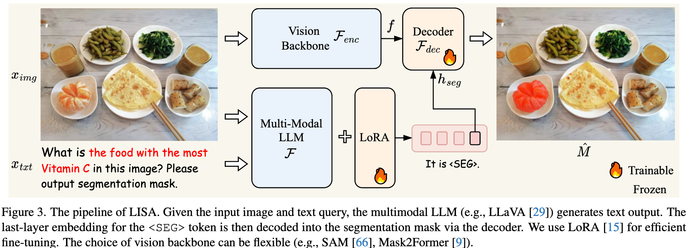
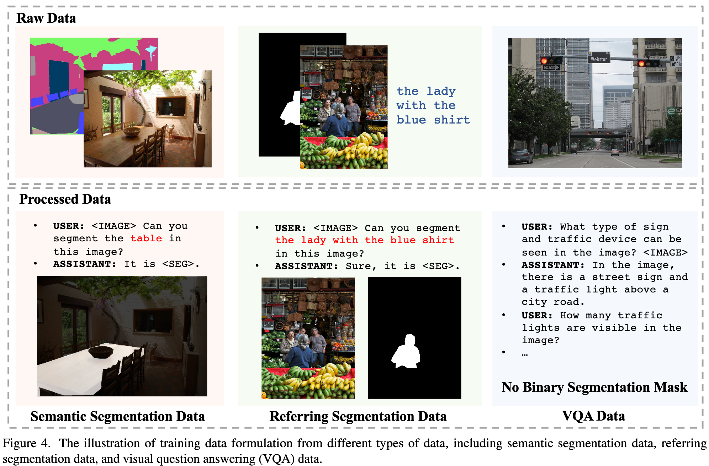

# LISA: Reasoning Segmentation via Large Language Model

**Author**: Xin Lai1* Zhuotao Tian2∗† Yukang Chen1 Yanwei Li1 Yuhui Yuan4 Shu Liu3 Jiaya Jia1,3

**Publish Date**: 2024

**Add Date**: 2025.11.22

**Journal/Meeting**: 2024 IEEE/CVF Conference on Computer Vision and Pattern Recognition (CVPR)

**Star**: 🌟🌟🌟🌟🌟

**PDF**: [LISA: Reasoning Segmentation via Large Language Model](original_files/Lai_2024_LISA_Reasoning_Segmentation_via_Large_Language_Model.pdf)

## 1 Introduction

***Reasoning Segmentation***: requires generating a binary segmentation mask based on an *implicit query text* involving *complex reasoning*.

**Abilities Needed:**

- Reasoning complex and implicit text queries jointly with the imgae.

- Producing segmentation masks.

**Limitation of Precious Studies**: fine-grained output formats.

***LISA***: a large **L**anguage **I**nstructed **S**egmentation **A**ssistant, a multimodal LLM capable of producing segmentation masks.

**Contribution**

- Introduce the ***reasoning segmentation*** task

- Present the model ***LISA***

- Establish a reasoning segmentation benchmark ***ReasonSeg***

## 2 Related Work

### 2.1 Image Segmentation

### 2.2 Multimodal Large Language Model

## 3 Reasoning Segmentation

### 3.1 Problem Definition

**Given**: an input image $X_{img}$ and an implicit query text instruction $X_{txt}$.

**Output**: a binary segmentation mask $\mathbf{M}$

### 3.2 Benchmark

To cover different scenarios, our text instructions consist of two types: 1) short phrases; 2) long sentences

## 4 Our Method

### 4.1 Architecture

**Embedding as Mask**

1. Expand the original LLM vocabulary with a new token, i.e., \<SEG\>.

2. Feed the text instruction $\mathbf{x}_{\text{txt}}$ and the input image $\mathbf{x}_{\text{img}}$ into the multimodal LLM $\mathcal{F}$, and outputs a text response $\hat{y}_{txt}$.

$$\hat{y}_{txt} = \mathcal{F}(\mathbf{x}_{\text{img}}, \mathbf{x}_{\text{txt}}). \tag{1}$$

3. Extract the LLM last-layer embedding $\tilde{\mathbf{h}}_{\text{seg}}$ corresponding to the \<SEG\> token and apply an MLP projection layer $\gamma$ to obtain $\mathbf{h}_{\text{seg}}$.

4. The vision backbone $\mathcal{F}_{\text{enc}}$ extracts the dense visual features $\mathbf{f}$ from the visual input $\mathbf{x}_{\text{img}}$.

5. $\mathbf{h}_{\text{seg}}$ and $\mathbf{f}$ are fed to the decoder $\mathcal{F}_{\text{dec}}$ to produce the final segmentation mask $\hat{\mathbf{M}}$.

$$
\begin{aligned}
\mathbf{h}_{\text{seg}} &= \gamma\left(\tilde{\mathbf{h}}_{\text{seg}}\right), \\
\mathbf{f} &= \mathcal{F}_{\text{enc}}\left(\mathbf{x}_{\text{img}}\right), \\
\hat{\mathbf{M}} &= \mathcal{F}_{\text{dec}}\left(\mathbf{h}_{\text{seg}},\mathbf{f}\right).
\end{aligned}
\tag{2}
$$

**Training Objectives**

$$\mathcal{L} = \lambda_{txt}\mathcal{L}_{txt} + \lambda_{mask}\mathcal{L}_{mask}. \tag{3}$$

$$
\begin{aligned}
\mathcal{L}_{txt} &= \mathbf{CE}(\hat{\mathbf{y}}_{txt}, \mathbf{y}_{txt}), \\
\mathcal{L}_{mask} &= \lambda_{bce} \mathbf{BCE}(\hat{\mathbf{M}}, \mathbf{M}) + \lambda_{dice} \mathbf{DICE}(\hat{\mathbf{M}}, \mathbf{M}).
\end{aligned}
\tag{4}
$$

### 4.2 Training

**Training Data Formulation**

- *Semanticc Segmentation Dataset*: 基础视觉感知

- *Vanilla Referring Segmentation Dataset*: 视觉定位与精确链接

- *Visual Question Answering Dataset*: 语言推理与世界知识

**Trainable Parameters**

## 5 Experiment

### 5.1 Experimental Setting

**Network Architecture**

**Implementation Details**

**Datasets**

**Evaluation Matrices**

### 5.2 Reasoning Segmentation Results

主要贡献

### 5.3 Vanilla Referring Segmentation Results

次要验证

### 5.4 Ablation Study

### 5.5 Qualitative Results

## 6 Conclusion