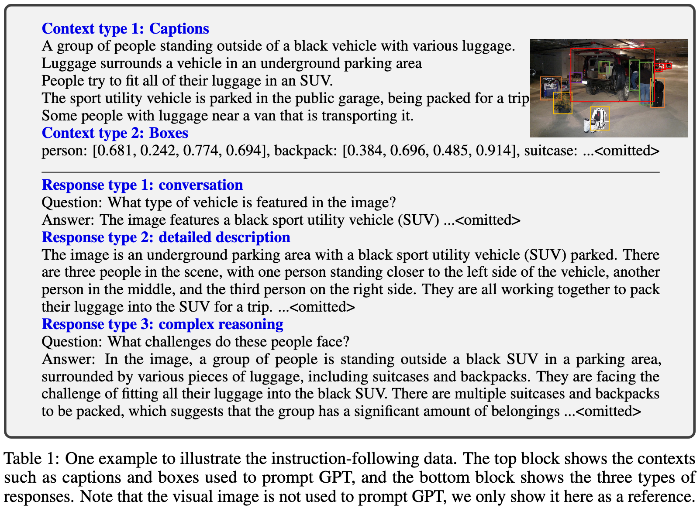
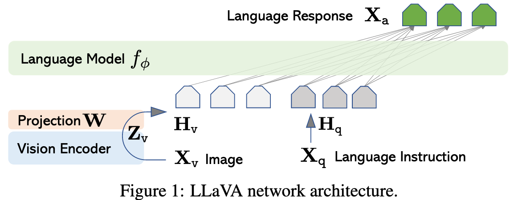

# Visual Instruction Tuning

**Author**: Haotian Liu1∗, Chunyuan Li2∗, Qingyang Wu3, Yong Jae Lee1

**Publish Date**: 2023

**Add Date**: 2025.11.22

**Journal/Meeting**: NeurIPS 2023

**Star**: 🌟🌟🌟🌟🌟

**PDF**: [Visual Instruction Tuning](original_files/Liu_2023_Visual_Instruction_Tuning.pdf)

## 1 Introduction

***Visual Instruction Tuning***: The first attempt to extend instruction-tuning to the language multimodal space, to pave the way towards building a general-purpose visual assistant.

**Contributions**:

- ***Multimodal instruction-following data***

- ***Large multimodal models***

- ***Multimodal instruction-following benchmark***

## 2 Related Work

**Multimodal Instruction-following Agents**

**Instruction Tuning**

## 3 GPT-assisted Visual Instruction Data Generation

Leverage **language-only GPT-4 or ChatGPT** as the teacher, to create instruction-following data involving visual content. 

(i) ***Captions*** typically describe the visual scene from various perspectives; 

(ii) ***Bounding boxes*** usually localize the objects in the scene, and each box encodes the object concept and its spatial location.

For each type, we first manually design a few examples. They are the only human annotations we have during data collection, and are used as seed examples in in-context-learning to query GPT-4.

- ***Conversation***

- ***Detailed description***

- ***Complex Reasoning***

## 4 Visual Instruction Tuning

### 4.1 Architecture

$$H_{v}=W\cdot Z_{v}, \text{ with } Z_{v}=g(X_{v}) \quad (1)$$

### 4.2 Training

$$X_{\text{instruct}}^{t} = \begin{cases} \text{Randomly choose } [X_{q}^{1},X_{v}] \text{ or } [X_{v},X_{q}^{1}], & \text{the first turn } t=1 \\ X_{q}^{t}, & \text{the remaining turns } t>1 \end{cases} \quad (2)$$

$$p(X_{a}|X_{v},X_{\text{instruct}})=\prod_{i=1}^{L}p_{\theta}(x_{i}|X_{v},X_{\text{instruct},<i},X_{a,<i}), \quad (3)$$

- **Stage 1: Pre-training for Feature Alignment**: Trainable parameters $\bold{\theta} = \mathbf{W}$

- **Stage 2: Fine-tuning End-to-End**: Trainable parameters $\bold{\theta} = \{\mathbf{W}, \bold{[\phi]}\}$

## 5 Experiments

### 5.1 Multimodal Chatbot

**Quantitative Evaluation**

**LLaVA-Bench(COCO)**

**LLaVA-Bench (In-the-Wild)**

**Limitations**

### 5.2 ScienceQA

## 6 Conclusion

