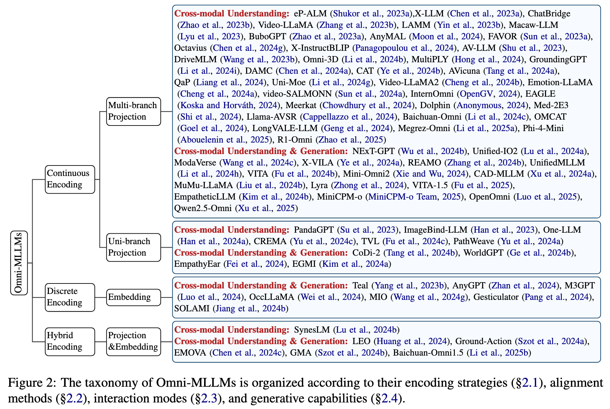
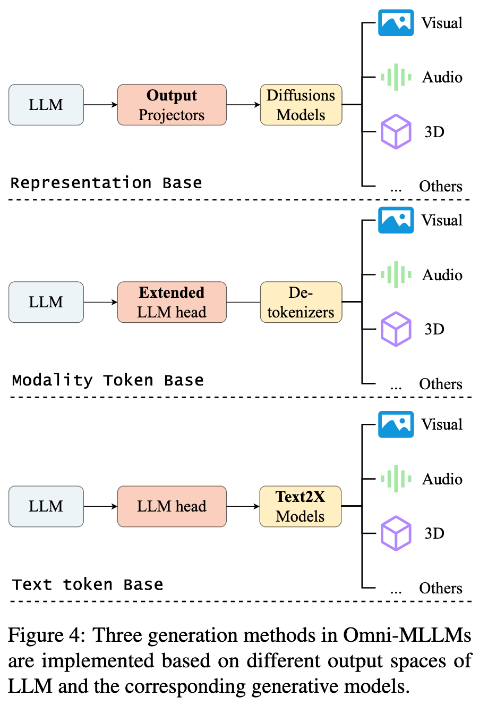

# From Specific-MLLMs to Omni-MLLMs: A Survey on MLLMs Aligned with Multi-modalities

**Author**: Shixin Jiang1, Jiafeng Liang1, Jiyuan Wang1, Xuan Dong1, Heng Chang3  Weijiang Yu3, Jinhua Du4, Ming Liu1,2*, Bing Qin1,2 

**Publish Date**: 2025 

**Add Date**: 2025.10.15 

**Journal/Meeting**: Findings of the Association for Computational Linguistics: ACL 2025 

**Star**: 🌟🌟🌟🌟

**PDF**: [From Specific-MLLMs to Omni-MLLMs: A Survey on MLLMs Aligned with Multi-modalities](original_files/Jiang_2025_From_specific-MLLMs_to_omni-MLLMs_A_survey_on_MLLMs_aligned_with_multi-modalities.pdf)

## 1 Introduction

**核心问题**​：为了解决现实世界中复杂的多模态任务，研究焦点正从处理单一模态的特定MLLMs（Specific-MLLMs）转向能够实现全模态理解和生成的Omni-MLLMs。

**​Omni-MLLMs的定义与目标​**

- **​目标**​：突破特定非语言模态的限制，将各种非语言模态映射到大型语言模型的嵌入空间中，使单个模型能够理解和交互任意组合的模态。

- **​能力**​：不仅能执行多类单模态任务，还能完成涉及两个或更多非语言模态的跨模态任务。

**​发展驱动力**

- **​模态数量**​：从处理视觉和音频，扩展到3D、IMU等，直至同时处理八种模态。

- **​交互能力**​：从跨模态推理（如3D-图像、音频-图像）扩展到跨模态生成（如根据交织的音频和图像上下文生成音频和图像），趋向于“任意到任意”的模型。

- **​应用场景**​：涵盖实时多模态语音交互、世界模拟、多传感器自动驾驶等。

**​本文贡献​**

- **​首个全面综述**​：首次专门针对Omni-MLLMs的系统性综述。

- **​细致分类法**​：提出了一个细致的分类法（见图2）。

- **​挑战与未来方向​**：指出了当前Omni-MLLMs的主要挑战并展望了未来研究。

## 2 Omni-MLLM Architecture

### 2.1 Multi-modalities Encoding

#### 2.1.1 Continuous Encoding

Continuous encoding refers to encoding the modality into the continuous feature space.

- **Heterogeneous Encoders**: $F_{x}=\mathrm{SpecificEncoder}(X), F_{x}\in\mathbb{R}_{x}$. $\mathrm{SpecificEncoder}$ refers to different modality-specific encoders used in Omni-MLLMs. These modality-specific encoders encode different modalities ($X$) into distinct feature spaces ($\mathbb{R}_{x}$) as ($F_x$). 

- **公式 (2)**: $F_{x}=\mathrm{PreAlignEncoder}(X), F_{x}\in\mathbb{R}_{uni}$。此公式代表使用预对齐编码器的连续编码方法。它将不同的模态 ($X$) 编码 ($F_x$) 到相同的特征空间 ($\mathbb{R}_{uni}$)。$\mathrm{PreAlignEncoder}$ 指的是那些能统一编码多种模态的编码器，例如 LanguageBind 或 ImageBind。

#### 2.1.2 Discrete Encoding

#### 2.1.3 Hybrid Encoding

### 2.2. Multi-modalities Alignment

#### 2.2.1 Projection Alignment

#### 2.2.2 Embedding Alignment

### 2.3 Multi-modalities Interaction

### 2.4 Multi-modalities Generation

- **Text-based**

- **Modality-Token-based**

- **Representation-based**

## 3 Omni-MLLM Training

### 3.1 Multi-modalities Alignment Pre-training

#### 3.1.1 Input Alignment

#### 3.1.2 Output Alignment

#### 3.2 Multi-modalities Instruction Fine-tuning

### 3.3 Other Train Recipes

## 4 Data Construction and Evaluation

### 4.1 Training Data

- **Alignment Data**

- **Instruction Data**

### 4.2 Benchmark

- **Uni-modal Understanding**

- **Uni-modal Generation**

- **Cross-modal Understanding**

- **Cross-modal Generation**

## 5 Challenges and Future Directions

### 5.1 Expansion of modalities

- **Training efficiency**

- **Catastrophic forgetting**

- **Low-resource modalities**

### 5.2 Cross-modal capabilities**

- **Long Context**

- **Modality Bias**

- **Temporal Alignment**

- **Data and Benchmark**

### 5.3 Application scenarios

- **Real-time Multi-modalities Interaction**

- **Comprehensive Planning**

- **World Simulator**

## 6 Conclusion
