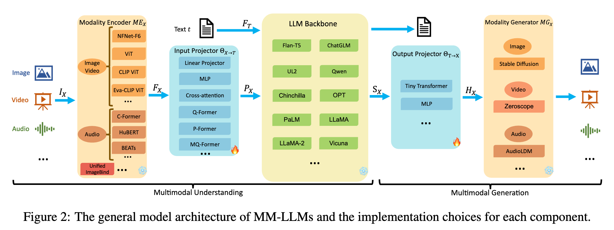
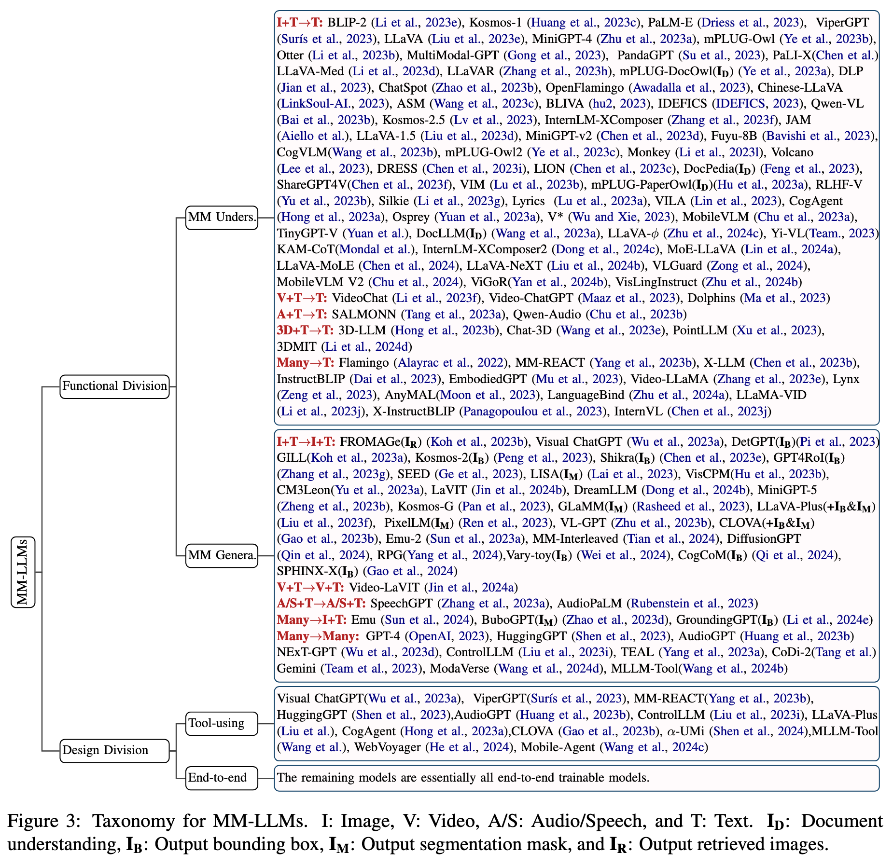
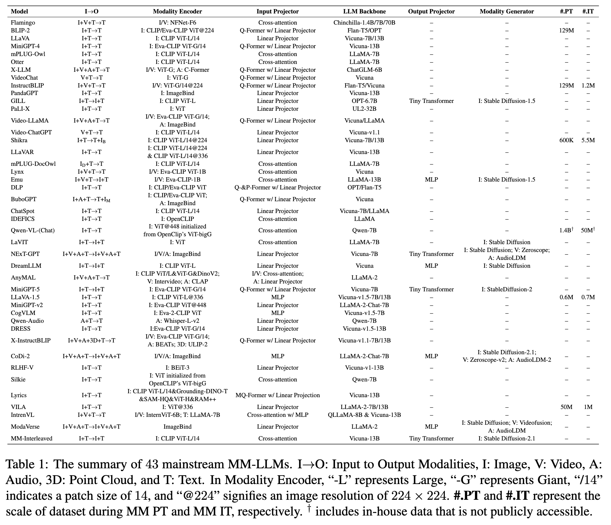
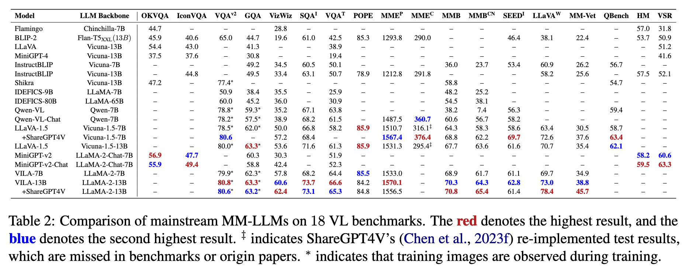

# MM-LLMs: Recent Advances in MultiModal Large Language Models

**Author**: Duzhen Zhang1*‡ , Yahan Yu3* , Jiahua Dong4†, Chenxing Li1 , Dan Su1, Chenhui Chu3† and Dong Yu2

**Publish Date**: 2024

**Add Date**: 2025.10.16

**Journal/Meeting**: Findings of the Association for Computational Linguistics ACL 2024

**Star**: 🌟🌟🌟🌟🌟

**PDF**: [MM-LLMs: Recent Advances in MultiModal Large Language Models](original_files/Zhang_2024_MM-LLMs_Recent_Advances_in_MultiModal_Large_Language_Models.pdf)

---

## 1 Introduction

#### Core Challenge

**Modality Alignment**: a MM Pre-Training (PT) + MM Instruction-Tuning (IT) pipeline.

#### Research of MM-LLMs

**Begining**: **GPT-4(Vision)** (OpenAI, 2023) and **Gemini** (Team et al., 2023)

**Initial**: MM content **comprehension** and **text generation**

**Later**: support specific modality **outputs**

**Recent**: mimicking human-like **any-to-any** modality conversion.

---

## 2 Model Architecture

### 2.1 Modality Encoder

$$\boldsymbol{F}_{X}={ME}_{X}(I_{X})$$

- **Modality Encoder** ${ME}_{X}$: encode inputs from diverse modalities $I_X$ to obtain corresponding features $\boldsymbol{F}_X$.

- **Inputs** $I_X$: inputs from diverse modalities.

- **Modalities Features** $\boldsymbol{F}_X$: corresponding features of $I_X$.

**Explaination**: 由于 LLM 本身只能理解文本，因此必须先将图像、视频等非文本数据通过一个专门的“翻译器”（即模态编码器 $ME_X$）转换成 LLM 能够处理的数字格式 ($F_X$)。

### 2.2 Input Projector

$$\arg \min_{\Theta_{X\rightarrow T}} \mathcal{L}_{txt-gen}(LLM(\boldsymbol{P}_{X},F_{T}),t), \quad \text{where} \ \boldsymbol{P}_X = \boldsymbol{\Theta}_{X\rightarrow T}(\boldsymbol{F}_X)$$

- **Input Projector** $\Theta_{X\rightarrow T}$: align the encoded features of other modalities $\boldsymbol{F}_X$ with the text feature space $T$. The Input Projector can be achieved directly by a **Linear Projector** or **Multi-Layer Perceptron (MLP)**. There are also more complex implementations like **Cross-attention**, **Q-Former** (Li et al., 2023e), **P-Former** (Jian et al., 2023), and **MQ-Former** (Lu et al., 2023a).

- **Prompts** $\boldsymbol{P}_X$: Features of other modalities proceessed with $\Theta_{X\rightarrow T}$.

- **Text Features** $\boldsymbol{F}_T$

- **Ground Truth Text** $t$

- **text generation loss** $\mathcal{L}_{txt-gen}$

**Explaination**: 训练输入投影器。首先，将模态特征 $F_X$ 通过投影器 $\Theta_{X\rightarrow T}$ 转换成提示 $P_X$。然后，将这个提示 $P_X$ 和文本特征 $F_T$ 一起送入 LLM。LLM 会根据这些输入生成一段文本。损失函数 $\mathcal{L}_{txt-gen}$ 会计算 LLM 的输出与标准答案 $t$ 之间的差异。训练的目标就是不断调整投影器的参数 $\Theta_{X\rightarrow T}$，让这个差异变得尽可能小。这样一来，投影器就学会了如何将非文本信息“翻译”成 LLM 能够准确理解的语言。

### 2.3 LLM Backbone

$$t, \boldsymbol{S}_X = LLM(\boldsymbol{P}_X, \boldsymbol{F}_T)$$

- **Direct Textual Outputs** $t$

- **Signal Token** $\boldsymbol{S}_X$

**Explaination**: LLM 在接收并理解了所有模态的输入 ($\boldsymbol{P}_X$ 和 $\boldsymbol{F}_T$) 后，其输出是多功能的。它不仅能像普通语言模型一样直接回答问题或描述内容（生成 $t$），还能在需要时输出一些特殊的“指令”($\boldsymbol{S}_X$)，用于驱动其他模块（如图像生成器）工作。

Moreover, some works have introduced **Parameter-Efficient Fine-Tuning (PEFT)** methods, such as Prefix-tuning (Li and Liang, 2021), LoRA (Hu et al., 2021), and LayerNorm tuning (Zhao et al., 2024).

### 2.4 Output Projector

$$\arg \min_{\Theta_{T\rightarrow X}} \mathcal{L}_{mse}(H_X, \tau_X(t)), \quad \text{where} \ \boldsymbol{H}_X = \Theta_{T\rightarrow X}(\boldsymbol{S}_X)$$

- **Output Projector** $\Theta_{T\rightarrow X}$: maps the signal token representations SX from the LLM Backbone into features $\boldsymbol{H}_X$ understandable to the following Modality Generator ${MG}_X$. The Output Projector is implemented by a Tiny Transformer with a learnable decoder feature sequence or MLP.

- **Features** $\boldsymbol{H}_X$

- **Textual Condition Encoder** $\tau_X$

- **Target Features** $\tau_X(t)$

- **Mean Squared Error Loss** $\mathcal{L}_{mse}$

**Explaination**: 训练输出投影器。我们希望输出投影器产生的特征 ($H_X$) 能够被模态生成器正确理解。为了实现这一点，我们将 LLM 基于文本 $t$ 生成的信号令牌 $S_X$ 转换成 $H_X$。同时，我们将同一段文本 $t$ 直接输入到模态生成器（如 Stable Diffusion）的文本编码器 $\tau_X$ 中，得到一个“标准”的条件特征 $\tau_X(t)$。训练的目标是让 $H_X$ 和 $\tau_X(t)$ 尽可能地接近（即最小化它们之间的均方误差）。这样，输出投影器就学会了如何生成与模态生成器兼容的指令。

### 2.5 Modality Generator

$$\mathcal{L}_{X-gen}:=\mathbb{E}_{\epsilon\sim\mathcal{N}(0,1),t}||\epsilon-\epsilon_{X}(z_{t},t,\boldsymbol{H}_X)||_{2}^{2}$$

- $\mathcal{L}_{X-gen}$: 模态 $X$ 的生成损失 (generation loss)。

- $\mathbb{E}$: 数学期望，表示对随机变量（这里是噪声 $\epsilon$ 和时间步 $t$）求平均值。

- $\epsilon$: 从标准正态分布中随机采样的噪声。

- $\epsilon_X$: 一个预训练的 U-Net 模型，它的任务是预测添加到数据中的噪声。

- $z_t$: 带噪声的潜变量。它是由原始数据的潜变量 $z_0$ 加上噪声 $\epsilon$ 得到的。

- $\boldsymbol{H}_X$: 由输出投影器生成的条件特征，用于指导生成过程。

**Object**: 这是一个用于训练潜在扩散模型 (Latent Diffusion Models, LDM) 的损失函数，通过优化这个目标来间接训练输入和输出投影器。

**Explaination**: 扩散模型的标准训练过程。首先，将一个真实的样本（如图片）编码到潜空间得到 $z_0$，然后给它添加随机噪声 $\epsilon$ 得到一个“模糊”的版本 $z_t$。接下来，让 U-Net 模型 ($\epsilon_X$) 观察这个模糊的 $z_t$ 和我们提供的条件信息 $\boldsymbol{H}_X$，并尝试预测出当初添加的噪声 $\epsilon$ 是什么。损失函数 $\mathcal{L}_{X-gen}$ 计算的是真实噪声与模型预测的噪声之间的均方误差。通过最小化这个误差，U-Net 模型就学会了如何在 $\boldsymbol{H}_X$ 的指导下去除噪声、复原数据，从而也就具备了生成全新数据的能力。在 MM-LLM 的框架下，这个损失函数被用来同时优化输入和输出两个投影器。

>***Question***: 
**在多模态生成损失部分，为什么不直接计算真实值和模型预测值之间的均方误差，而要计算真实噪声与模型预测的噪声之间的均方误差？**

>***Answer*** (Gemini 2.5 Pro):
这是一个非常深刻的问题，它触及了扩散模型（Diffusion Models）的核心设计思想。在多模态生成任务中，当使用像Stable Diffusion这样的潜在扩散模型（LDM）作为生成器时，其损失函数（即论文中的公式5）之所以选择计算**真实噪声**与**模型预测噪声**之间的均方误差，而不是直接计算**真实图像**与**生成图像**的误差，主要有以下几个关键原因：
**1. 任务更简单，训练过程更稳定**
**预测目标是已知的简单分布**：在扩散模型的“前向过程”中，我们向原始数据中添加的噪声 $\epsilon$ 是从一个非常简单的、已知的概率分布（通常是标准正态分布 $\mathcal{N}(0, 1)$）中采样的。这意味着模型（通常是U-Net架构）的学习目标——噪声 $\epsilon$ 本身——具有非常稳定和明确的统计特性。
**预测原始数据是复杂的**：相比之下，真实世界的数据（如图像、音频）的分布是极其复杂和多样的。让模型从一个充满噪声的输入 $z_t$ 直接预测出清晰的原始数据 $z_0$ 是一个非常困难的“一对多”问题，因为有无数种可能的清晰图像在添加噪声后都能得到相似的 $z_t$。直接预测 $z_0$ 会让模型的学习任务变得非常困难，容易导致训练不稳定或生成模糊的结果。
简单来说，**让模型学会预测一个结构简单、分布已知的噪声，比让它直接凭空“幻想”出一个结构复杂的清晰图像要容易得多，也稳定得多**。
**2. 生成质量更高，细节更丰富**
扩散模型是一个迭代去噪的过程。在每一步，模型都只专注于预测并移除当前时间步的少量噪声。
**由粗到精的生成**：在生成过程的早期阶段（$t$ 很大，噪声很多），模型主要学习恢复数据的整体结构和轮廓。在后期阶段（$t$ 很小，噪声很少），模型则专注于添加精细的纹理和细节。
**避免模式坍塌和模糊**：这种分步、渐进式的生成方式，使得模型能够构建出非常高质量和细节丰富的图像。如果直接预测最终图像，模型很可能会在不确定的区域生成“平均”的、模糊的像素，因为它试图一步到位找到一个最安全的答案。而预测噪声则迫使模型在每一步都做出明确的、局部的决策，从而保留了更多的细节。
**3. 数学上的等价性和便利性**
从数学上讲，在给定的噪声输入 $z_t$ 下，预测添加的噪声 $\epsilon$ 与预测去噪后的原始数据 $z_0$ 其实是**等价的**。我们可以通过一个简单的公式在这两者之间进行转换。
知道了当前的带噪数据 $z_t$ 和模型预测出的噪声 $\epsilon_{\theta}(z_t, t, H_X)$，我们就可以估算出原始的清晰数据 $z_0$。虽然模型训练时是在预测噪声，但在实际生成（推理）时，它利用这个预测出的噪声来计算出上一步（噪声更少）的数据 $z_{t-1}$，并不断重复这个过程，最终得到清晰的 $z_0$。
选择预测噪声作为训练目标，仅仅是因为它在实践中为神经网络提供了一个**更直接、更稳定、更容易学习的优化目标**。

>**总结**
我们可以用一个比喻来理解：
想象一下修复一张严重损坏、充满雪花点的旧照片。
**直接预测最终照片**：就像让一个修复师看着满是雪花点的照片，然后凭记忆和想象直接画出一张全新的、清晰的照片。这个任务非常困难，结果很可能与原作有偏差。
**预测并去除噪声**：就像让修复师仔细识别照片上的每一个雪花点（噪声），然后用周围的像素信息把它精确地填充掉。这个任务更具体、更有依据。通过一遍又一遍地重复这个“识别并去除噪声”的过程，最终就能完美地恢复出原始照片。
扩散模型的训练正是采用了第二种更稳健、更精确的策略。

---

## 3 Training Pipeline

现有的 MM-LLMs 所使用的具体训练数据各不相同，但它们通常都是表 3 (PT 数据) 和表 4 (IT 数据) 中所列数据集的子集 。

### 3.1 MM PT (Pre-Training)

**目标**: 此阶段的核心目标是实现“模态对齐” 。它使用大规模的 “X-Text” 数据集（例如，图像-文本对、视频-文本对）来训练模型中的连接器，即输入投影器 (Input Projector) 和输出投影器 (Output Projector)。

**训练内容**

对于多模态理解 (MM understanding) 模型（只接受多模态输入，输出文本），训练目标是最小化在给定多模态信息下的文本生成损失，即只优化公式 (2)。

对于多模态生成 (MM generation) 模型（可输出多模态内容），训练目标则更为复杂，需要同时优化三个目标：文本生成损失（公式 2）、输出对齐损失（公式 4）和模态生成损失（公式 5）。

**训练数据**

此阶段使用的数据集被称为 X-Text 数据集，包括图像-文本、视频-文本和音频-文本数据 。

数据格式主要有两种：

- 配对数据: 例如 <img1> <txt1> 的形式 。

- 交错数据 (interleaved): 例如 <txt1><img1><txt2><txt3><img2><txt4> 这种文本和图像/视频交错出现的形式 。

论文在表 3 中汇总了这些预训练数据集的细节 。

### 3.2 MM IT (Instruction-Tunning)

**目标**: 此阶段的目的是让模型学会遵循人类的指令，从而提升其在未见过的新任务上的零样本 (zero-shot) 泛化能力 。它旨在使模型与人类的意图对齐，并增强其交互能力 。

**组成**: MM IT 包含两个步骤：**监督微调 (SFT)** 和**来自人类反馈的强化学习 (RLHF)**。

#### 3.2.1 监督微调 (Supervised Fine-Tuning, SFT)

过程: SFT 将一部分预训练数据转换成“指令感知”的格式 。

示例: 论文以视觉问答 (QA) 为例，同样的数据可以被格式化为不同的指令模板 ：

模板 1: "&lt;Image&gt;{Question}" A short answer to the question is; 

模板 2: "&lt;Image&gt;" Examine the image and respond to the following question with a brief answer: "{Question}. Answer:" 

数据类型: SFT 数据集可以是单轮问答，也可以是多轮对话的形式 。

#### 3.2.2 来自人类反馈的强化学习 (Reinforcement Learning from Human Feedback, RLHF)

过程: 在 SFT 之后，RLHF 会根据人类对模型生成答案的反馈来进一步微调模型 。

反馈形式: 这种反馈通常是“自然语言反馈” (Natural Language Feedback, NLF)，可以由人工标注或自动生成 。

训练: 由于 NLF 这种反馈是不可微分的（即不能直接用于梯度下降），模型会使用强化学习算法来学习如何根据这种反馈生成更符合人类偏好和意图的回答 。

---

## 4 SOTA MM-LLMs

本章首先对 126 个先进的 (SOTA) MM-LLMs 进行了分类，主要从“功能划分”和“设计划分”两个角度。

**功能划分 (Functional Division)**

- **MM Unders. (多模态理解)**: 这类模型专注于理解多模态输入并仅生成文本输出 。例如，输入是图像+文本（I+T），输出是文本（T）。

- **MM Genera. (多模态生成)**: 这类模型不仅能理解输入，还能生成多模态内容（如图像、音频等）作为输出 。例如，输入是图像+文本，输出也是图像+文本。

**设计划分 (Design Division)**

- **Tool-using (工具使用)**: 这类模型将 LLM 视为一个黑盒 ，通过推理来调用外部的专家系统（即“工具”）来执行特定的多模态任务。

- **End-to-end (端到端)**: 这类模型的所有组件都是联合训练的。

论文还提供了 表 1，详细对比了 43 个主流 MM-LLMs 的架构实现和训练数据规模。

最后，本章总结了现有 MM-LLMs 的**发展趋势**：

- **功能演进**: 从专注于多模态理解，发展到特定模态的生成，再进一步演变为任意模态到任意模态 (any-to-any) 的转换（例如，MiniGPT-4 → MiniGPT-5 → NEXT-GPT）。

- **训练流程优化**: 训练流程不断完善，从多模态预训练 (MM PT) 到监督微调 (SFT)，再到强化学习 (RLHF)，目标是更好地与人类意图对齐并增强对话能力（例如，BLIP-2 → InstructBLIP → DRESS）。

- **模态扩展**: 拥抱多样化的模态扩展，不仅仅局限于视觉和语言（例如，BLIP-2 → X-LLM）。

- **数据质量**: 采用更高质量的训练数据集（例如，LLaVA → LLaVA-1.5）。

- **架构效率**: 采用更高效的模型架构，例如从 BLIP-2 中复杂的 Q-Former 模块过渡到 VILA 中更简单但有效的线性投影器。

---

## 5 Benchmarks and Performance

本章首先在 表 2 中汇总了主流 MM-LLMs 在 18 个视觉语言 (VL) 基准测试上的性能对比。

随后，论文重点分析了模型在四个特定基准上的表现：

- **OKVQA**: 这个基准需要模型利用常识、世界知识和视觉知识进行推理。MiniGPT-v2 和 MiniGPT-v2-chat 在此表现最佳，展示了其卓越的推理能力。

- **IconVQA**: 强调对抽象图表的理解和认知推理。MiniGPT-v2 在此也表现出色 23。

- **$VQA^{v2}$**: 这是一个更平衡的 VQA 数据集。VILA-13B 在此表现最好，显示了其强大的多模态信息理解能力和对语言偏见的抵抗力。

- **GQA**: 这是一个专注于图像场景图和组合式问题的 VQA 数据集 26。LLaVA-1.5 和 VILA-7B 在此表现最佳。

接下来，本章从 SOTA 模型中提炼出了几个可提升 MM-LLMs 效果的**训练秘诀 (Training Recipes)**：

**更高的图像分辨率**:更高的分辨率（如 $336\times336$ 或 $448\times448$）能为模型带来更多视觉细节，有益于需要细粒度信息的任务。但这会增加训练和推理成本。MiniGPT-v2 通过在嵌入空间中拼接相邻的视觉标记来解决此问题。Monkey 模型则提出了一种方法，仅使用低分辨率编码器就能支持高达 $1300\times800$ 的分辨率。

**高质量的 SFT 数据**:在 SFT 阶段加入高质量的数据（如 ShareGPT4V 数据）可以显著提高模型在特定任务上的性能，如表 2 中 LLaVA-1.5 和 VILA-13B 的性能提升所示。

**VILA 模型揭示的关键发现**:在 LLM 骨干上执行 PEFT（参数高效微调）对于促进深层嵌入对齐至关重要，这对上下文学习 (ICL) 很关键。使用交错的 (Interleaved) 图像-文本数据是有益的，而仅使用图像-文本对数据是次优的。在 SFT 阶段，将纯文本指令数据与图像-文本数据重新混合，不仅解决了纯文本任务性能下降的问题，甚至还提高了 VL 任务的准确性。

---

## 6 Future Directions

- **More General and Intelligent Models**

- **More Challenging Benchmarks**

- **Mobile/Lightweight Deployment**

- **Embodied Intelligence**

- **Continual Learning**

- **Mitigating Hallucination**

---

## 7 Conclusion

Website: https://mm-llms.github.io