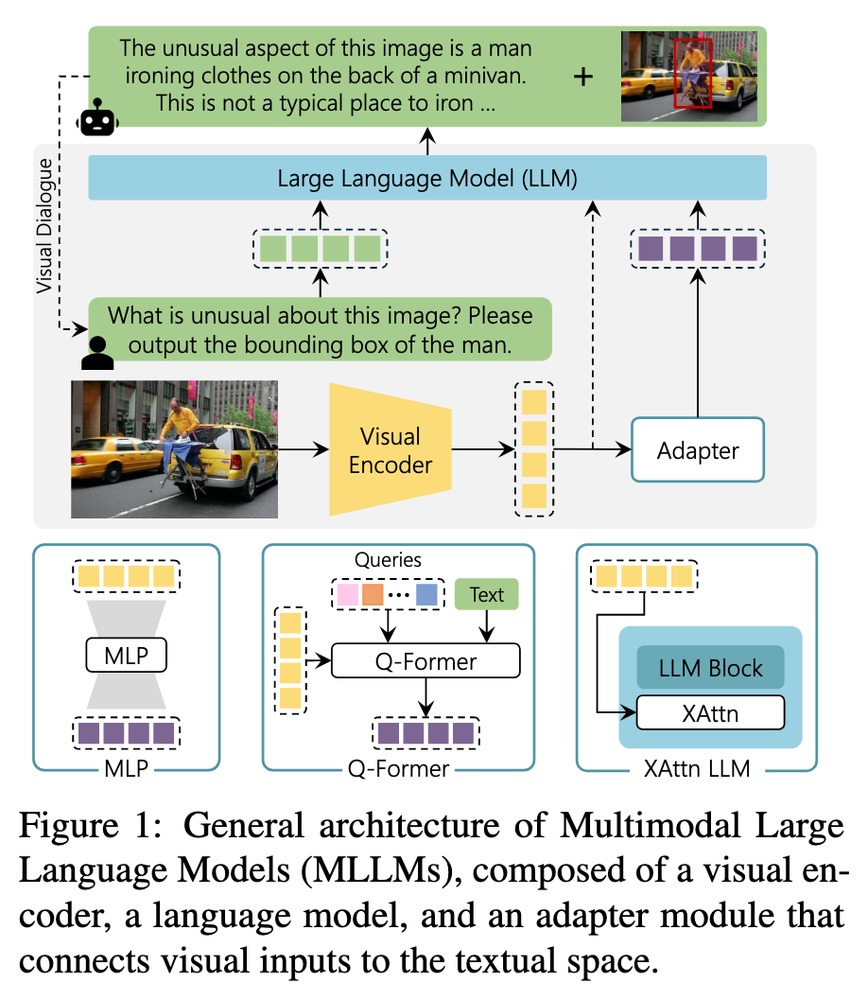
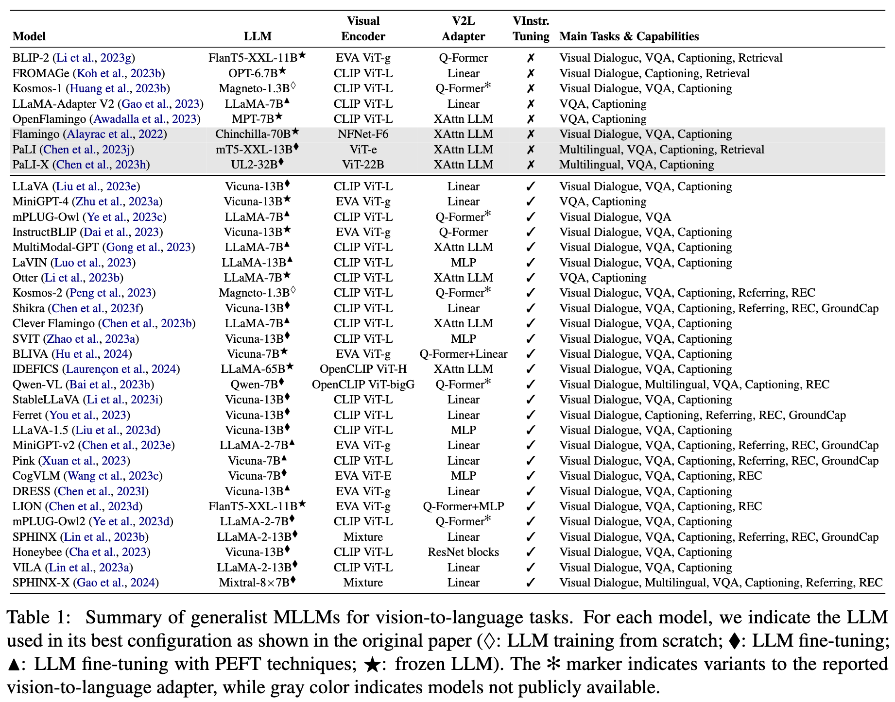
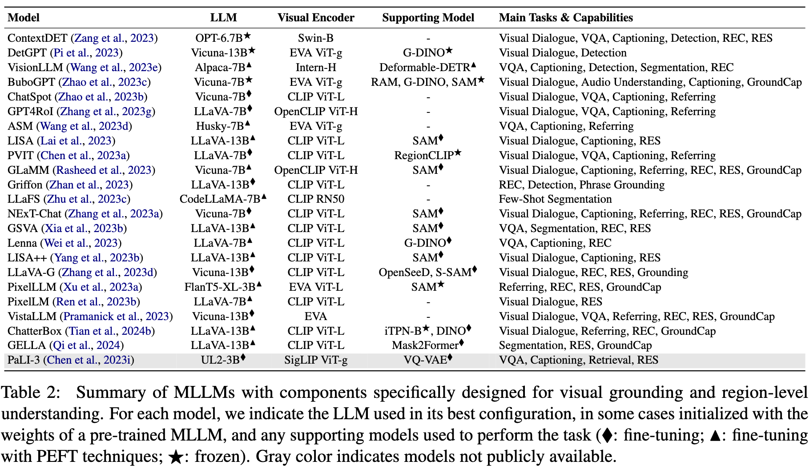
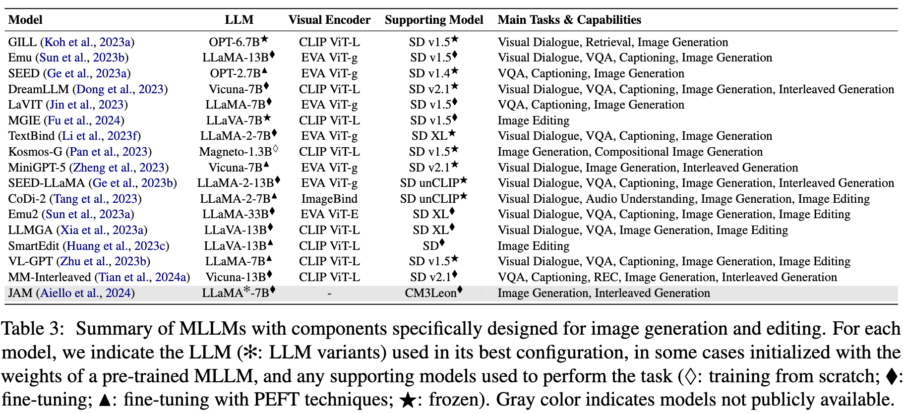

# The Revolution of Multimodal Large Language Models: A Survey

**Author**: Davide Caffagni1*, Federico Cocchi1,2*, Luca Barsellotti1*, Nicholas Moratelli1*, Sara Sarto1*, Lorenzo Baraldi2*, Lorenzo Baraldi1, Marcella Cornia1, and Rita Cucchiara1,3

**Publish Date**: 2024

**Add Date**: 2025.10.15

**Journal/Meeting**: Findings of the Association for Computational Linguistics ACL 2024

**Star**: 🌟🌟🌟🌟

**PDF**: [The Revolution of Multimodal Large Language Models: A Survey](original_files/Caffagni_2024_The_Revolution_of_Multimodal_Large_Language_Models_A_Survey.pdf)

## 1 Introduction

**​核心主题**​：多模态大语言模型（MLLMs）通过融合视觉与文本模态，实现生成式对话与指令跟随能力。

**​研究背景**​：受Transformer架构和LLMs成功启发，模型从单模态扩展到多模态（如GPT-4V、Gemini）。

**​论文贡献**​：全面分析视觉模态MLLMs的架构、训练方法、任务性能及挑战，覆盖200+篇文献。

## 2 Empowering LLMs with Multimodal Capabilities

### 2.1 Preliminaries

#### Parameter-efficient fine-tuning (PEFT) 

When a pre-trained LLM needs to be adapted to a specific domain or application, PEFT schemes represent an important alternative to train the entire LLM, since these strategies **only introduce a few new parameters**.

常用技术包括 **prompt tuning**、**LoRA** 和 **QLoRA**

>***Question***: 
**PEFT和FT以及SFT有什么区别？**

>***Answer*** (Deepseek):
**FT（全参数微调）**
​定义​：传统微调方法，更新预训练模型的所有参数
​特点​：需要大量计算资源和存储空间；适合数据充足、任务特定的场景；在文档中体现为"LLM fine-tuning"标记
**SFT（监督式微调）**
​定义​：FT的一种特殊形式，专注于指令跟随能力的优化
​特点​：使用高质量的指令-回答对进行训练；目标是使模型行为与人类期望对齐；在MLLMs中发展为"visual instruction-tuning"
**PEFT（参数高效微调）**
定义​：仅训练少量新增参数，保持预训练权重冻结
​特点​：显著降低计算和存储需求；支持快速领域适应；在MLLMs训练中被广泛采用

#### Towards Multimodal LLMs

- **in-context learning**

- **visual instruction-tuning**

- **components**: 1. LLM backbone; 2. visual encoders; 3. vision-to-language adapter modules.

#### Pre-Training of Model Components

- **visual encoder**: is designed to provide LLMs with visual information and the most used ones are CLIP-based architectures (Radford et al., 2021; Wortsman et al., 2022) whose pretraining objective is the alignment between **CLIP (Contrastive Language-Image Pre-training)** embeddings, obtained thanks to a contrastive loss that aligns the correct image-text pairs.

- **LLMs**: primarily rely on the widely employed Transformer model, although the Mamba architecture (Gu and Dao, 2023) has also emerged in recent times.

### 2.2 Visual Encoder

The most often employed visual encoders are based on **pre-trained Vision Transformer (ViT)** models with a CLIP-based objective to exploit the inherent alignment of CLIP embeddings.

### 2.3 Vision-to-Language Adapters

Facilitate interoperability between the visual and textual domains.

- **Linear and MLP Projections**

- **Q-Former**

- **Additional Cross-Attention Layers**

### 2.4 Multimodal Training

- **Single-Stage Training**

- **Two-Stage Training**

- **Training Data**

## 3 Tackling Visual Tasks with MLLMs

### 3.1 Visual Grounding

- **Region-as-Text**: **directly** insert them into generated text as **a series of coordinates**, represented as numbers or as special tokens dedicated to location bins.

- **Embedding-as-Region**: read input regions through **region encoders** and provide the output regions as **embeddings** extracted from the last layer of the MLLM to a decoder.

- **Text-to-Grounding**: based on **open-vocabulary models** that accept textual categories as input.

### 3.2 Image Generation and Editing

- **Connecting MLLMs with Diffusion Models**: map the output embedding space of a **frozen LLM** to that of a **frozen diffusion model**.

- **End-to-End Pipelines**: 

### 3.3 Other Modalities and Applications

- **Video Understanding**

- **Any-Modality Models**

- **Domain-Specific MLLMs**

## 4 Conclusion and Future Directions

- **Multimodal Retrieval-Augmented Generation**

- **Correction of Hallucinations**

- **Prevent Harmful and Biased Generation**

- **Reducing Computational Load**