# Natural Language Reasoning, A Survey

**Author**: Fei Yu, Hongbo Zhang, Prayag Tiwari, Benyou Wang*

**Publish Date**: 2024

**Add Date**: 2025.11.2

**Journal/Meeting**: ACM Computing Surveys

**Star**: 🌟🌟🌟🌟🌟

**PDF**: [Natural Language Reasoning, A Survey](original_files/Yu_2024_Natural_Language_Reasoning_A_Survey.pdf)

## 1 Introduction

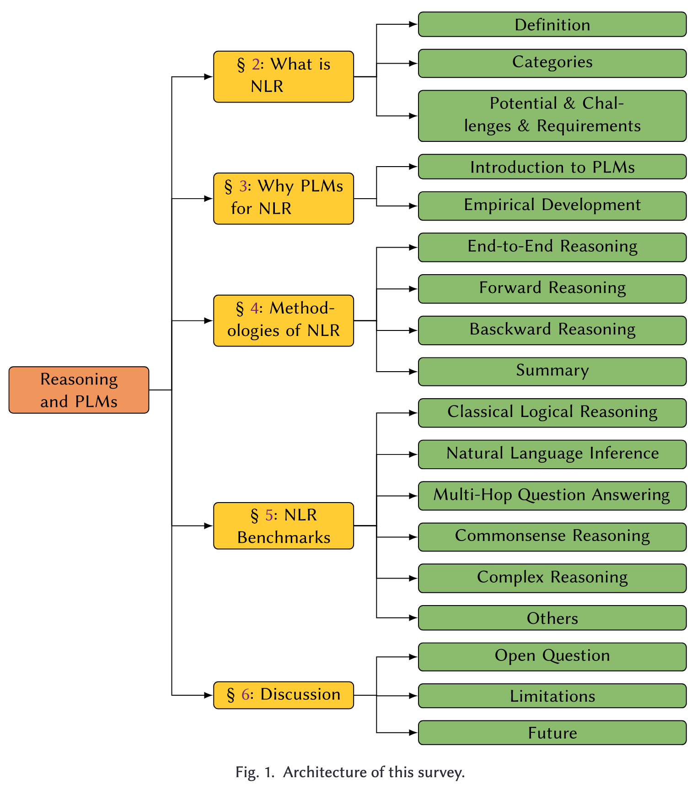

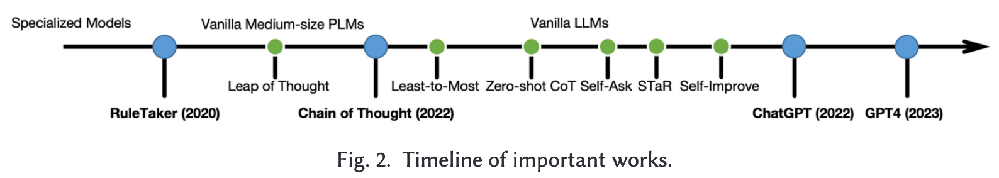

## 2 What is NLR

### 2.1 Definition

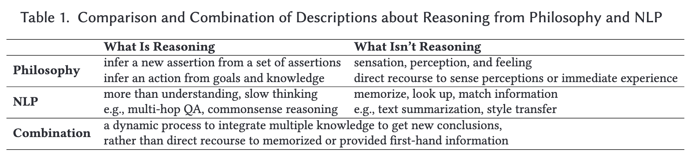

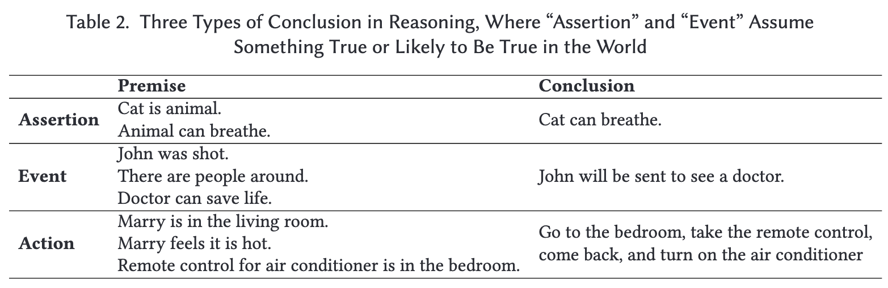

**Definition 2.4 (NLP Reasoning)**. NLR is a process to integrate multiple knowledge (e.g., encyclopedic knowledge and commonsense knowledge) to derive some new conclusions about the (realistic or hypothetical) world. Knowledge can be from both explicit and implicit sources. Conclusions are assertions or events assumed to be true in a world, or practical actions.

**Definition 2.5 (NLP Proposition)**. A proposition is the semantic meaning or information content of a statement rather than its superficial linguistics. (命题)

**Definition 2.6 (NLP Inference)**. Inference is a single step that produces a single (intermediate) conclusion from some premises.

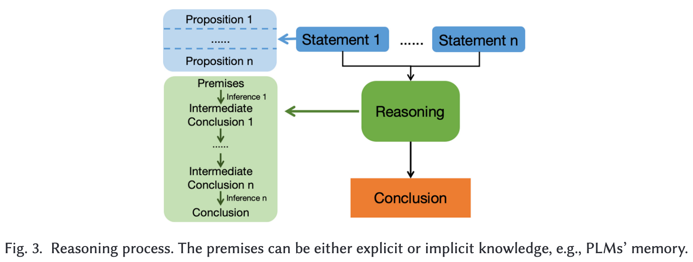

### 2.2 Categories of Inference

**Definition 2.7 (Deduction)**. A deductive inference is to infer valid knowledge (conclusion) from the given knowledge (premises).  (演绎推理)

**Definition 2.8 (Induction)**. An inductive inference is to infer probable knowledge, which describes a more general rule,5 extrapolated from the given knowledge.  (归纳推理)

**Definition 2.9 (Abduction)**. An abductive inference is to infer probable knowledge, as the best explanation (i.e., cause), for the given knowledge (i.e., phenomena).  (溯因推理)

| 推理类型 | 目标/特点 | 示例模式 |
| --- | --- | --- |
| **演绎推理 (Deduction)** | 从一般性规则和前提推导出必然的、特殊的结论。结论的正确性由前提保证。 | 前提 1: 所有的鸟都会飞。 前提 2: 麻雀是鸟。 结论: 麻雀会飞。 |
| **归纳推理 (Induction)** | 从特殊的事实或观察中推导出一般性的规则或结论。结论可能正确，但不保证必然正确。 | 观察 1: 我见过的所有麻雀都会飞。 观察 2: 我见过的所有鸽子都会飞。 结论 (归纳): 所有的鸟都会飞。 |
| **溯因推理 (Abduction)** | 从观察到的结果和已知规则，推导出最佳的解释或原因。结论是最可能的解释。 | 规则: 如果下雨，地面就会湿。 结果: 地面湿了。 结论 (溯因): 可能是下雨了。 |

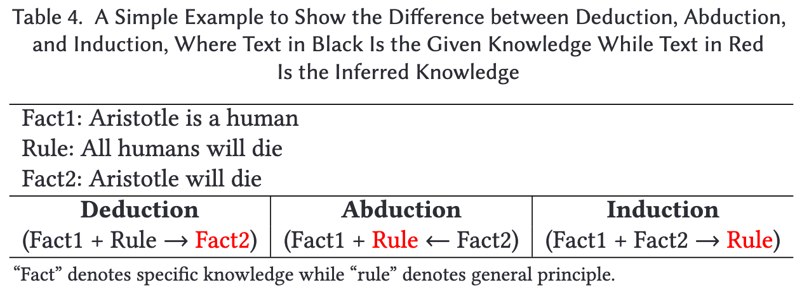

**Our main goal is to promote research on non-deductive reasoning and highlight the differences and challenges.**

| 推理模式 | 特点 | 示例 |
| --- | --- | --- |
| **严格/单调推理 (Strict/Monotonic)** | 结论是必然的。新的信息不会改变结论。 | 前提: 所有人都会死。 前提: 苏格拉底是人。 结论: 苏格拉底会死。 |
| **可废止/非单调推理 (Defeasible/Non-monotonic)** | 结论是推测性的、暂定的。新的信息可能使结论失效。 | 初始知识： 鸟会飞。 推论： 企鹅是一只鸟，所以企鹅会飞。 新信息（废止）： 企鹅不会飞。 最终结论： 企鹅不会飞。 |

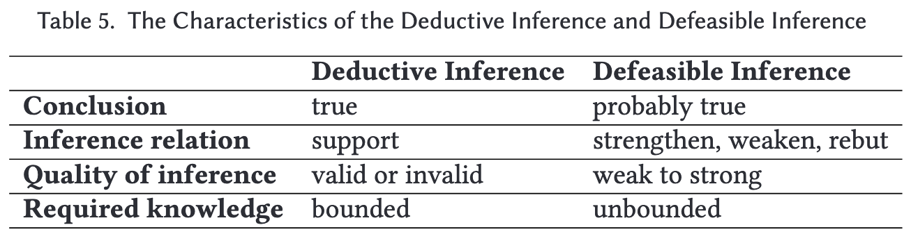

### 2.3 Potentials, Challenges, and Requirements of NLR

**Potentials**:

- Better human-comuter interaction inferface

- Opens a door to play with defeasible reasoning

**Challenges**:

- Nature language suffer from ambiguity and variety

- Supervised data of inference is difficult to obtain

- The step of reasoning is diverse

**Requirements**:

- Knowledge obtain

- Knowledge understanding

- Knowledge inference

## 3 Why PLMs For NLR

PLMs can learn to perform multi-step reasoning from supervised data or fewshot demonstrations. Their capabilities of natural language understanding, generalization, and leveraging implicit knowledge make them promising to deal with arbitrary natural language, commonsense knowledge, and defeasible reasoning.

## 4 Methodologies of NLR

| 特征 | 端到端推理 (End-to-End) | 前向推理 (Forward Reasoning) | 反向推理 (Backward Reasoning) |
| -- | -- | -- | -- |
| 推理方向 | 隐式/无方向 (Input $\rightarrow$ Output) | 数据驱动： 从证据/前提 $\rightarrow$ 结论 | 目标驱动： 从结论/目标 $\rightarrow$ 所需前提 | 
| 逻辑步骤 | 隐式，模型内部完成，不展示。 | 显式，按顺序生成中间步骤/结论。 | 显式，将目标分解为子目标或所需条件。| 
| 可解释性 | 低 (黑箱)，难以追溯推理路径。 | 中/高 (提供思维链 CoT)，过程相对透明。 | 高 (提供分解结构或证明路径)，目标清晰。|
| 对复杂任务的鲁棒性 | 差，难以处理多步推理和例外。 | 中，容易受早期错误影响（贪婪搜索）。 | 强，通过分解管理复杂性，专注解决子目标。| 
| 典型应用 | 简单的分类任务、单步问答。 | 多步演绎推理、常识推理。 | 复杂的多跳问答、逻辑证明、诊断。| 
| LLM实现技术 | 标准提示 (Standard Prompting) | 思维链 (Chain-of-Thought, CoT) | 问题分解 (Question Decomposition)、反向链 (Backward Chaining) |

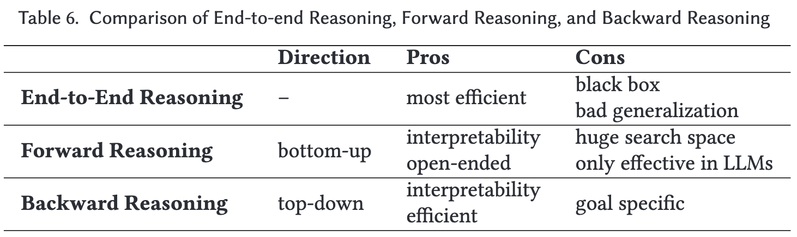

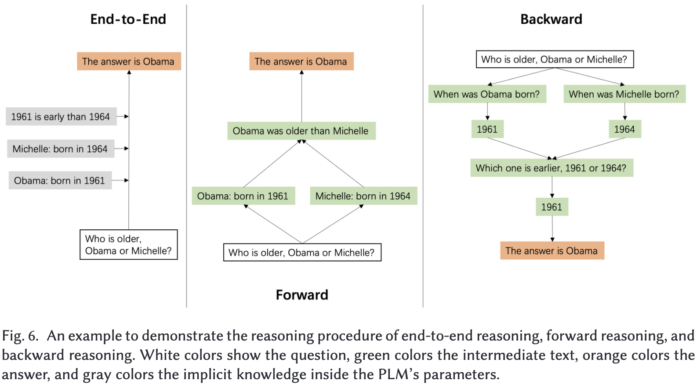

### 4.1 End to End Reasoning

Rely heavily on handcrafts, introducing strong prior assumptions, which may hurt the generalization ability to other tasks.

### 4.2 Forward Reasoning

### 4.3 Backward Reasoning

### 4.4 Summary

## 5 NLR Benchmarks

### 5.1 Classical Logical Reasoning

#### 5.1.1 Deductive Reasoning

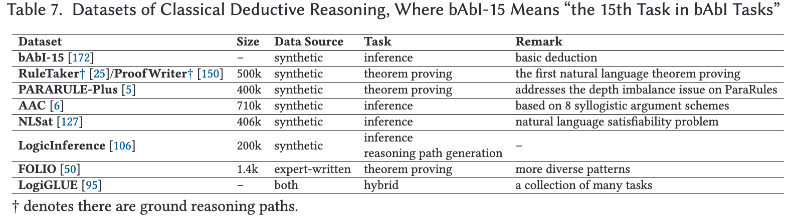

- **Inference**: reason the conclusion given the premises in a single step

- **Theoerm proving**: predict whether the given proposition is true or false with the given knowledge bases

- **Reasoning path generation**: an interpretable task that can be complementary to multi-step reasoning

#### 5.1.2 Defeasible Reasoning

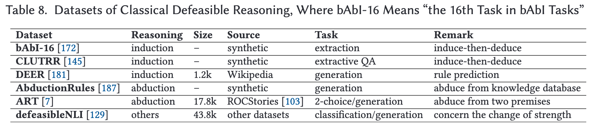

- **Deductive Reasoning**

- **Abductive Reasoning**

### 5.2 Nature Language Inference

### 5.3 Multi-hop Question Answering

### 5.4 Commonsense Reasoning

### 5.5 Complex Reasoning

### 5.6 Others

## 6 Discussion

### 6.1 Open Questions

### 6.2 Limitations

### 6.3 Future